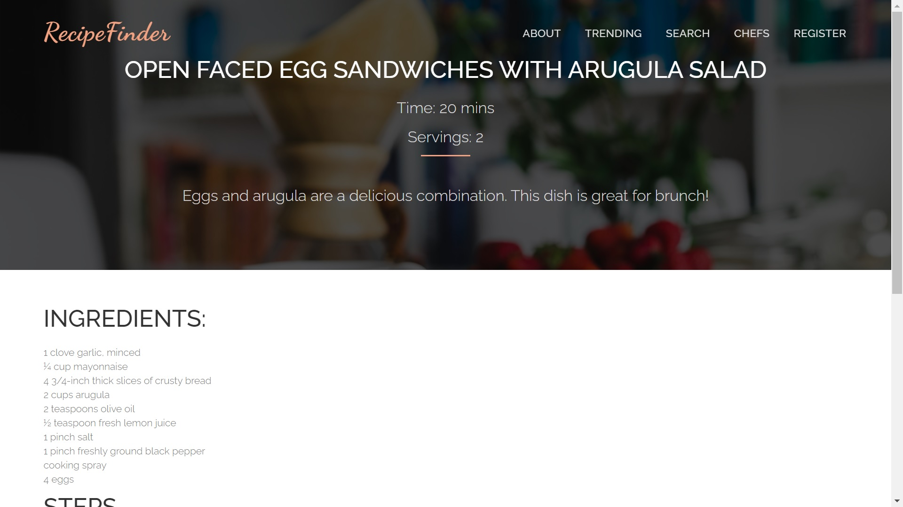

# RecipeFinder

Recipes Finder is a cooking platform, which allows you to find the right recipes for the ingredients you have.

## Description

Discover more than 600 cooking recipes searchable by ingredients.

## Build Requirements

* [Docker](https://docs.docker.com/get-docker/)
* [Docker Compose](https://docs.docker.com/compose/install/)

## Build

You can use docker to build the projects easily. 

Run `docker-compose up -d` in the root folder of the project. 

The web UI is available at `localhost:3000`

## Screenshots

